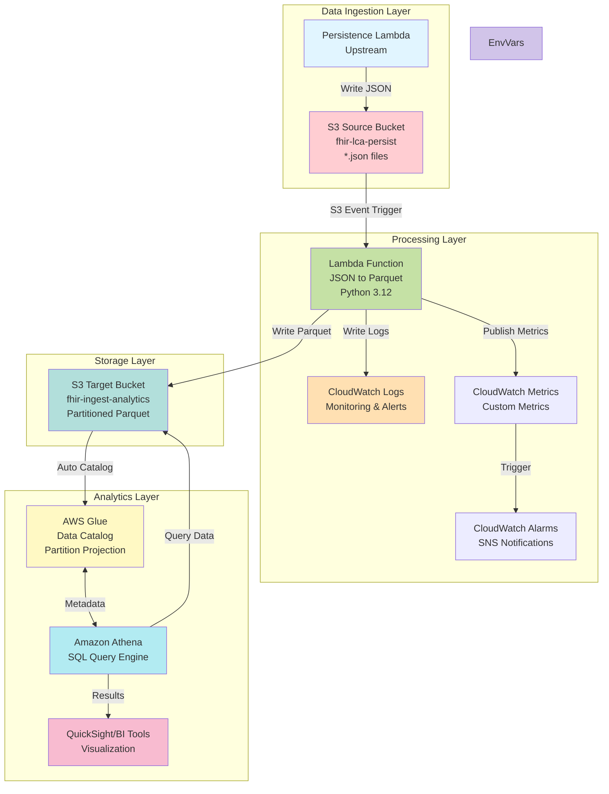
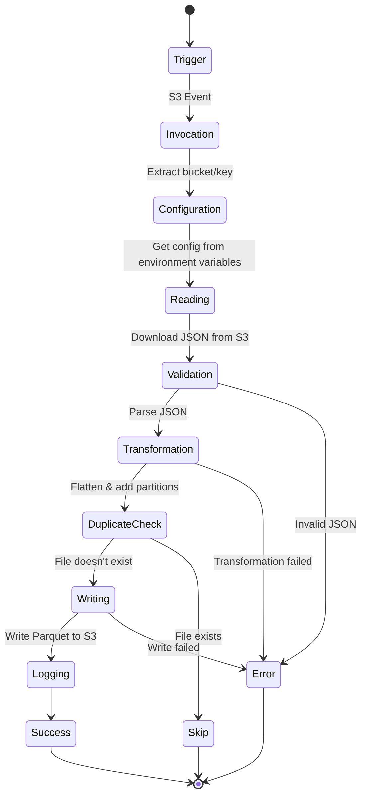
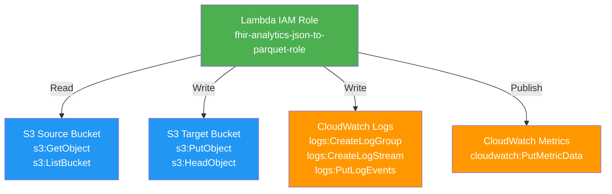
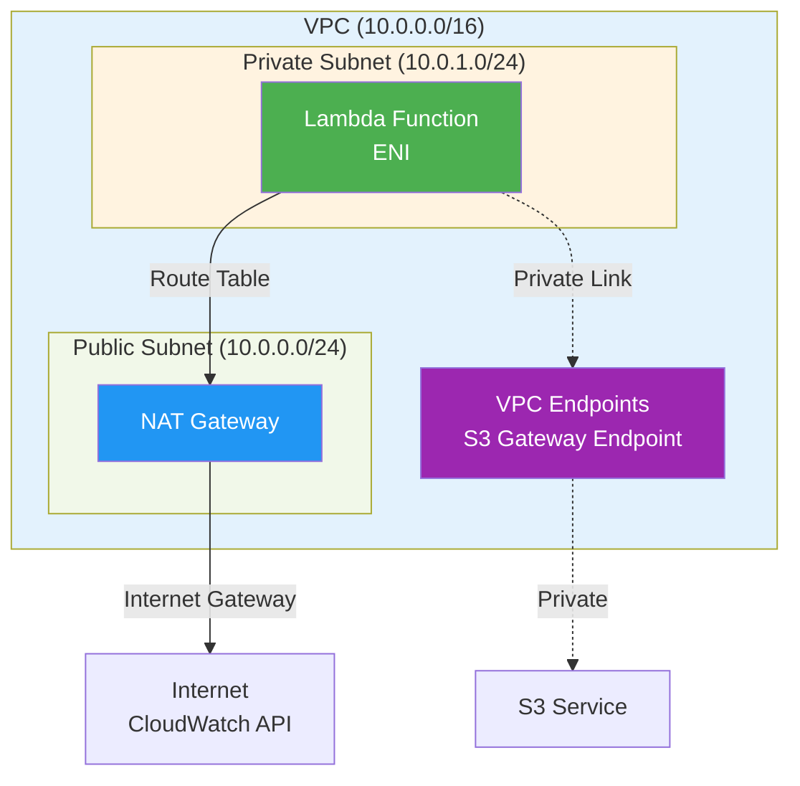

# Architecture Documentation

## System Overview

The FHIR Analytics Lambda solution provides a serverless, scalable architecture for converting JSON files from persistence layers into analytics-ready Parquet format.

## High-Level Architecture



## Component Details

### 1. S3 Source Bucket (`fhir-lca-persist`)

**Purpose:** Stores raw JSON files from persistence Lambda

**Configuration:**
- Versioning: Enabled
- Encryption: AES-256 (SSE-S3)
- Event Notifications: Configured for `*.json` files
- Lifecycle Policy: Optional archiving to Glacier

**Input Format:**
```json
[
  {
    "s3Filename": "abc123-response.json",
    "source": "lca-persist",
    "statusCode": 200,
    "patientId": "PT-67890",
    ...
  }
]
```

### 2. Analytics Lambda Function

**Runtime:** Python 3.12  
**Memory:** 512 MB (configurable)  
**Timeout:** 300 seconds (5 minutes)  
**Concurrency:** Reserved capacity optional

**Key Features:**
- Automatic JSON flattening with operationOutcome explosion
- Handles nested structures (meta + response array)
- Skips 2xx status codes (only processes errors)
- Duplicate detection
- Comprehensive error handling with categorized errors
- Structured logging with request ID tracking
- CloudWatch custom metrics
- Cost optimization (reserved concurrency)

**Dependencies (Lambda Layer):**
- Uses AWS public layer: `AWSSDKPandas-Python312`
- Includes: `awswrangler`, `pandas`, `pyarrow`, `boto3`
- No custom layer build needed (configurable)

**Environment Variables:**
```bash
SOURCE_BUCKET=fhir-lca-persist
TARGET_BUCKET=fhir-ingest-analytics
LOG_LEVEL=INFO
```

### 3. S3 Target Bucket (`fhir-ingest-analytics`)

**Purpose:** Stores analytics-ready Parquet files

**Partitioning Strategy:**
```
s3://fhir-ingest-analytics/data/
  source=<source_system>/
    ingest_date=<YYYY-MM-DD>/
      hour=<HH>/
        <filename>.parquet
```

**Example:**
```
s3://fhir-ingest-analytics/data/
  source=lca-persist/
    ingest_date=2025-12-03/
      hour=14/
        abc123-response.parquet
        def456-response.parquet
  source=dxa-persist/
    ingest_date=2025-12-03/
      hour=14/
        ghi789-response.parquet
```

**Parquet Configuration:**
- Compression: Snappy
- Row group size: Default (128 MB)
- Schema: Dynamically generated from JSON

### 4. AWS Glue Data Catalog

**Database:** `fhir_analytics`  
**Table:** `fhir_ingest_analytics`

**Partition Columns:**
- `source` (string) - Source system identifier
- `ingest_date` (string) - Date in YYYY-MM-DD format
- `hour` (string) - Hour in HH format (00-23)

**Partition Projection:**
Enabled for automatic partition discovery without MSCK REPAIR

```sql
'projection.enabled'='true'
'projection.source.type'='enum'
'projection.source.values'='lca-persist,dxa-persist'
'projection.ingest_date.type'='date'
'projection.ingest_date.range'='2025-01-01,NOW'
'projection.ingest_date.format'='yyyy-MM-dd'
'projection.hour.type'='integer'
'projection.hour.range'='00,23'
'projection.hour.digits'='2'
```

### 5. Amazon Athena

**Query Engine:** Presto-based SQL (Athena engine version 3)  
**Database:** `fhir_analytics` (auto-created)  
**Workgroup:** `fhir-analytics` (auto-created)  
**Results Bucket:** `{target-bucket}-athena-results` (auto-created)

**Query Performance:**
- Partition pruning: Automatic (partition projection)
- Predicate pushdown: Enabled
- Column pruning: Enabled
- Compressed data: Snappy compression
- No MSCK REPAIR needed: Partition projection enabled

## Data Flow

### Step-by-Step Process



**Detailed Steps:**

1. **Trigger:**
   - Persistence Lambda writes JSON to `s3://fhir-lca-persist/`
   - S3 emits `ObjectCreated:Put` event

2. **Invocation:**
   - Lambda receives S3 event notification
   - Extracts bucket name and object key
   - Logs invocation details

3. **Configuration:**
   - Reads environment variables
   - Configuration via environment variables (set by Terraform)
   - Determines source system from bucket/key

4. **Reading:**
   - Downloads JSON file from S3
   - Parses content (supports arrays, objects, JSONL)
   - Validates JSON structure

5. **Transformation:**
   - Flattens nested JSON using `pandas.json_normalize`
   - Converts to DataFrame
   - Adds partition columns (source, ingest_date, hour)

6. **Writing:**
   - Generates output S3 path with partitioning
   - Checks for existing file (skip if exists)
   - Writes Parquet with Snappy compression
   - Logs success metrics

7. **Cataloging:**
   - Glue automatically recognizes new partitions (via projection)
   - No manual intervention required

8. **Querying:**
   - Athena queries use partition pruning
   - Only scans relevant Parquet files
   - Returns results in seconds

## Security Architecture

### IAM Permissions



**Least Privilege Principle:**
- Read-only access to source bucket
- Write-only to specific prefix in target bucket
- CloudWatch metrics publish (custom namespace only)
- No delete permissions
- No SSM access (uses environment variables)

### Encryption

**Data at Rest:**
- S3: AES-256 server-side encryption
- Parquet: Compression (not encryption by default)
- Environment Variables: Set by Terraform (encrypted at rest by Lambda)

**Data in Transit:**
- TLS 1.2+ for all AWS API calls
- S3 transfer acceleration: Optional

### Network Security

**Default:** Lambda runs in AWS service network  
**Optional:** VPC deployment for enhanced isolation



## Scalability

### Concurrent Execution

**Lambda Scaling:**
- Default: 1,000 concurrent executions
- Burst: 3,000 initial burst (us-east-1)
- Reserved concurrency: Optional for guaranteed capacity

**S3 Throughput:**
- 3,500 PUT requests/second per prefix
- 5,500 GET requests/second per prefix
- No practical limit with proper prefix design

### Performance Tuning

**Lambda Memory vs. Cost:**

| Memory | vCPU | Cost/GB-second | Recommended For |
|--------|------|----------------|-----------------|
| 512 MB | 0.3  | $0.0000083333  | Small files (<1MB) |
| 1024 MB | 0.6 | $0.0000166667  | Medium files (1-10MB) |
| 2048 MB | 1.0 | $0.0000333333  | Large files (>10MB) |

**Batch Processing:**
- Process multiple S3 events per invocation
- Use SQS for buffering (advanced)
- Parallel processing within Lambda

### Cost Optimization

**Strategies:**
1. **Right-size Lambda memory** - Start at 512MB, monitor metrics
2. **Enable S3 Intelligent-Tiering** - Automatic cost optimization
3. **Use partition projection** - Avoid Glue Crawler costs
4. **Compress Parquet** - Reduce storage and query costs
5. **Set log retention** - Don't keep logs forever

**Cost Breakdown (10K files/month):**
```
Lambda:       $0.10/month
S3 Storage:   $0.23/month (10GB)
S3 Requests:  $0.05/month
CloudWatch:   $0.50/month
Athena:       $0.01/month (100 queries)
───────────────────────────
Total:        ~$0.89/month
```

## Monitoring & Observability

### CloudWatch Metrics

**Lambda Metrics (AWS/Lambda):**
- `Invocations` - Total executions
- `Duration` - Execution time
- `Errors` - Failed executions
- `Throttles` - Rate limiting
- `ConcurrentExecutions` - Parallel invocations

**Custom Metrics (FHIRAnalytics/Lambda):**
- `Errors` - Errors by category
- `ErrorsByCategory` - Error breakdown
- `FilesProcessed` - Successfully processed files
- `FilesFailed` - Failed file processing
- `InvocationDuration` - Function execution time
- `ParquetWriteDuration` - Parquet write time
- `RecordsProcessed` - Number of records
- `InputFileSize` - Input file size
- `FatalErrors` - Fatal errors

### CloudWatch Logs

**Log Structure:**
```
[TIMESTAMP] [REQUEST_ID] [LEVEL] Message
```

**Example:**
```
[2025-12-03T14:30:45.123Z] [a1b2c3d4] [INFO] Processing file: s3://fhir-lca-persist/test.json
[2025-12-03T14:30:45.234Z] [a1b2c3d4] [INFO] Read 100 JSON records
[2025-12-03T14:30:45.456Z] [a1b2c3d4] [INFO] Flattened 100 records with 16 columns
[2025-12-03T14:30:46.123Z] [a1b2c3d4] [INFO] Successfully wrote Parquet file
```

### Alarms (Automatically Created)

**Critical Alarms:**
1. Error rate > threshold (default: 5 per 5 minutes)
2. Duration > 80% of timeout
3. Throttling detected (> 0)
4. Fatal errors detected (> 0)

**Optional Alarms:**
1. No invocations in 24 hours (staleness check)

**All alarms send notifications to SNS topic** (email subscription optional)

### Distributed Tracing

**AWS X-Ray Integration:**
```python
# Add to Lambda
from aws_xray_sdk.core import xray_recorder

@xray_recorder.capture('flatten_json')
def flatten_json(records):
    # ... existing code ...
```

## Disaster Recovery

### Backup Strategy

**S3 Versioning:**
- Source bucket: Enabled
- Target bucket: Enabled
- Retention: 30 days

**Cross-Region Replication:**
```hcl
resource "aws_s3_bucket_replication_configuration" "target_replication" {
  bucket = "fhir-ingest-analytics"
  
  rule {
    status = "Enabled"
    
    destination {
      bucket = "arn:aws:s3:::fhir-ingest-analytics-dr"
      storage_class = "STANDARD_IA"
    }
  }
}
```

### Recovery Procedures

**Scenario 1: Lambda Failure**
- CloudWatch Logs retain error details
- Retry failed files manually or via SQS DLQ
- Redeploy Lambda from Terraform

**Scenario 2: Data Corruption**
- S3 versioning allows rollback
- Reprocess files from source bucket
- Athena queries remain unaffected

**Scenario 3: Regional Outage**
- Cross-region replication provides DR copy
- Redeploy Lambda in secondary region
- Update Glue catalog to point to DR bucket

### RTO/RPO

**Recovery Time Objective (RTO):** < 1 hour  
**Recovery Point Objective (RPO):** < 5 minutes

## Future Enhancements

### Phase 2 Features

1. **Data Quality Validation**
   - Pre-conversion schema validation
   - Data quality metrics in CloudWatch
   - Reject invalid records to DLQ

2. **Real-time Processing**
   - Kinesis Data Streams for streaming
   - Lambda processes micro-batches
   - Near real-time analytics

3. **Advanced Partitioning**
   - Multi-level partitioning (date/hour/source/customer)
   - Dynamic partition columns
   - Partition coalescing for small files

4. **ML Integration**
   - SageMaker for anomaly detection
   - Automated data quality scoring
   - Predictive analytics

5. **Data Governance**
   - AWS Lake Formation for access control
   - Data lineage tracking
   - PII detection and masking

## References

- [AWS Lambda Best Practices](https://docs.aws.amazon.com/lambda/latest/dg/best-practices.html)
- [AWS Glue Partition Indexing](https://docs.aws.amazon.com/athena/latest/ug/glue-best-practices.html)
- [Apache Parquet Documentation](https://parquet.apache.org/docs/)
- [AWS Data Wrangler](https://aws-sdk-pandas.readthedocs.io/)

---

**Last Updated:** 2025-12-05  
**Version:** 1.0  
**Maintainer:** FHIR Analytics Team

