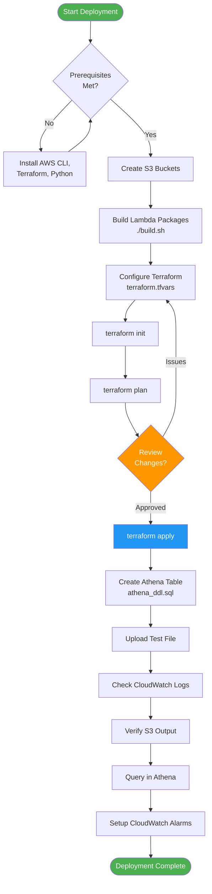

# Deployment Guide

Complete step-by-step guide for deploying the FHIR Analytics Lambda solution.

## Deployment Flow



## Prerequisites Checklist

- [ ] AWS Account with admin or appropriate IAM permissions
- [ ] AWS CLI installed and configured (`aws configure`)
- [ ] Python 3.12 installed
- [ ] Terraform 1.0+ installed
- [ ] S3 buckets created:
  - [ ] Source bucket: `fhir-lca-persist`
  - [ ] Target bucket: `fhir-ingest-analytics`
  - [ ] Athena results bucket (if needed)

## Step 1: Verify AWS Configuration

```bash
# Check AWS credentials
aws sts get-caller-identity

# Expected output shows your account ID and user ARN
```

## Step 2: S3 Buckets

**Terraform will create the S3 buckets automatically!**

The following are created by Terraform:
- ✅ Source bucket (`fhir-lca-persist`)
- ✅ Target bucket (`fhir-ingest-analytics`)
- ✅ Versioning enabled on both
- ✅ AES-256 encryption enabled on both

**If buckets already exist:**

Set `create_buckets = false` in `terraform.tfvars` to use existing buckets.

## Step 3: Build Lambda Deployment Packages

```bash
# Navigate to project directory
cd /Users/mani/Documents/Workspace/AI_MCP/mcp_poc/aws_s3_parquet_glue_athena

# Make build script executable
chmod +x build.sh

# Run build
./build.sh
```

**Expected output:**
```
✅ Lambda function package created: lambda_function.zip
✅ Lambda layer created: lambda_layer.zip
```

## Step 4: Configure Terraform

```bash
cd terraform

# Copy example configuration
cp terraform.tfvars.example terraform.tfvars

# Edit with your values
nano terraform.tfvars  # or vim, code, etc.
```

**Update `terraform.tfvars`:**

```hcl
aws_region         = "us-east-1"  # Your AWS region
environment        = "prod"        # dev, staging, or prod
source_bucket      = "fhir-lca-persist"
target_bucket      = "fhir-ingest-analytics"
s3_filter_prefix   = ""           # Optional: filter by prefix
log_retention_days = 30           # CloudWatch log retention
lambda_zip_path    = "../lambda_function.zip"
lambda_layer_zip_path = "../lambda_layer.zip"
```

## Step 5: Deploy Infrastructure with Terraform

```bash
# Initialize Terraform
terraform init

# Validate configuration
terraform validate

# Review planned changes
terraform plan

# Apply infrastructure (will prompt for confirmation)
terraform apply

# Or auto-approve (use with caution)
terraform apply -auto-approve
```

**Expected output:**
```
Apply complete! Resources: 13 added, 0 changed, 0 destroyed.

Outputs:

lambda_function_arn = "arn:aws:lambda:us-east-1:123456789012:function:fhir-analytics-json-to-parquet"
lambda_function_name = "fhir-analytics-json-to-parquet"
lambda_role_arn = "arn:aws:iam::123456789012:role/fhir-analytics-json-to-parquet-role"
log_group_name = "/aws/lambda/fhir-analytics-json-to-parquet"
glue_database_name = "fhir_analytics"
glue_table_name = "fhir_ingest_analytics"
glue_table_location = "s3://fhir-ingest-analytics/data/"
```

**What Gets Created:**
- ✅ Lambda function with Python 3.12 runtime
- ✅ Lambda layer with awswrangler dependencies
- ✅ IAM role and policies
- ✅ S3 event notification trigger
- ✅ CloudWatch Log Group
- ✅ SSM parameters for configuration
- ✅ **AWS Glue Database** (`fhir_analytics`)
- ✅ **AWS Glue Table** (`fhir_ingest_analytics`) with partition projection

## Step 6: Verify Deployment

```bash
# Check Lambda function
aws lambda get-function \
  --function-name fhir-analytics-json-to-parquet

# Check Lambda layers
aws lambda get-function-configuration \
  --function-name fhir-analytics-json-to-parquet \
  --query 'Layers[*].Arn'

# Test Lambda manually
aws lambda invoke \
  --function-name fhir-analytics-json-to-parquet \
  --payload file://test_event.json \
  output.json

cat output.json
```

## Step 7: Verify Glue Resources

```bash
# Verify Glue database
aws glue get-database --name fhir_analytics

# Verify Glue table
aws glue get-table \
  --database-name fhir_analytics \
  --name fhir_ingest_analytics

# Check table schema
aws glue get-table \
  --database-name fhir_analytics \
  --name fhir_ingest_analytics \
  --query 'Table.StorageDescriptor.Columns[*].[Name,Type]' \
  --output table
```

**Expected output:**
```
Database: fhir_analytics
Table: fhir_ingest_analytics
Columns: 16 data columns + 3 partition columns
Partition Projection: ENABLED
```

## Step 8: Test End-to-End

### Upload Test File

```bash
# Upload example payload
aws s3 cp example_payload.json s3://fhir-lca-persist/test/example_payload.json

# Check CloudWatch Logs
aws logs tail /aws/lambda/fhir-analytics-json-to-parquet --follow
```

### Verify Output in S3

```bash
# List output files
aws s3 ls s3://fhir-ingest-analytics/data/ --recursive

# Expected output:
# 2025-12-03 14:30:45    12345  data/source=lca-persist/ingest_date=2025-12-03/hour=14/example_payload.parquet
```

### Query in Athena

**Glue database and table are already created by Terraform!**

```sql
-- In Athena Query Editor (https://console.aws.amazon.com/athena/)

-- 1. Count all records
SELECT COUNT(*) as total_rows
FROM fhir_analytics.fhir_ingest_analytics;

-- 2. View latest data
SELECT * 
FROM fhir_analytics.fhir_ingest_analytics
WHERE ingest_date = CAST(CURRENT_DATE AS VARCHAR)
LIMIT 10;

-- 3. Count by source
SELECT source, COUNT(*) as total
FROM fhir_analytics.fhir_ingest_analytics
GROUP BY source;

-- 4. Error analysis
SELECT 
  operationOutcomeCode,
  operationOutcomeSeverity,
  COUNT(*) as error_count
FROM fhir_analytics.fhir_ingest_analytics
WHERE operationOutcomeCode IS NOT NULL
GROUP BY operationOutcomeCode, operationOutcomeSeverity
ORDER BY error_count DESC;
```

## Step 9: Set Up Monitoring (Optional but Recommended)

### Create CloudWatch Alarms

```bash
# Error alarm
aws cloudwatch put-metric-alarm \
  --alarm-name fhir-lambda-errors \
  --alarm-description "Alert on Lambda errors" \
  --metric-name Errors \
  --namespace AWS/Lambda \
  --statistic Sum \
  --period 300 \
  --evaluation-periods 1 \
  --threshold 1 \
  --comparison-operator GreaterThanThreshold \
  --dimensions Name=FunctionName,Value=fhir-analytics-json-to-parquet

# Duration alarm (timeout warning)
aws cloudwatch put-metric-alarm \
  --alarm-name fhir-lambda-duration \
  --alarm-description "Alert on long Lambda duration" \
  --metric-name Duration \
  --namespace AWS/Lambda \
  --statistic Average \
  --period 300 \
  --evaluation-periods 2 \
  --threshold 240000 \
  --comparison-operator GreaterThanThreshold \
  --dimensions Name=FunctionName,Value=fhir-analytics-json-to-parquet
```

## Step 10: Production Readiness Checklist

- [ ] Lambda deployed successfully
- [ ] Lambda layer attached
- [ ] S3 event trigger configured
- [ ] CloudWatch logs accessible
- [ ] **Glue database created (`fhir_analytics`)**
- [ ] **Glue table created (`fhir_ingest_analytics`)**
- [ ] **Partition projection enabled**
- [ ] Athena queries working
- [ ] Test file processed successfully
- [ ] Parquet files visible in S3
- [ ] CloudWatch alarms configured
- [ ] IAM permissions reviewed (least privilege)
- [ ] S3 bucket encryption enabled
- [ ] S3 bucket versioning enabled
- [ ] Log retention configured appropriately
- [ ] Cost monitoring set up
- [ ] Documentation updated with team-specific info

## Rollback Procedure

If you need to rollback the deployment:

```bash
cd terraform

# Destroy all resources (buckets will be deleted with contents if force_destroy_buckets=true)
terraform destroy

# Or destroy specific resources
terraform destroy -target=aws_lambda_function.analytics_lambda
```

**⚠️ Important:** 
- If `force_destroy_buckets = true`, S3 buckets will be deleted with all their contents
- If `force_destroy_buckets = false`, you must empty buckets manually first
- Always backup data before destroying resources

See **TERRAFORM_DESTROY.md** for complete destroy guide.

## Updating the Lambda

### Update Code Only

```bash
# Build new package
./build.sh

# Update function code
aws lambda update-function-code \
  --function-name fhir-analytics-json-to-parquet \
  --zip-file fileb://lambda_function.zip
```

### Update with Terraform

```bash
# Rebuild packages
./build.sh

# Apply changes
cd terraform
terraform apply
```

## Troubleshooting Deployment

### Issue: Terraform init fails

**Solution:**
```bash
rm -rf .terraform .terraform.lock.hcl
terraform init
```

### Issue: Lambda layer too large

**Solution:** Layer size limit is 250MB. If exceeded:
```bash
# Use slimmer dependencies or AWS-provided layers
# AWS provides AWS Data Wrangler layer:
# arn:aws:lambda:<region>:336392948345:layer:AWSDataWrangler-Python312:1
```

Update `terraform/main.tf` to use public layer:
```hcl
layers = [
  "arn:aws:lambda:${var.aws_region}:336392948345:layer:AWSSDKPandas-Python312:1"
]
```

### Issue: Permission denied on build.sh

**Solution:**
```bash
chmod +x build.sh
./build.sh
```

### Issue: S3 bucket already exists

**Solution:**
```bash
# Use existing bucket or choose different name
# Update terraform.tfvars with correct bucket name
```

## Cost Estimation

Estimated monthly costs (us-east-1, processing 10,000 files/month):

| Service | Usage | Cost |
|---------|-------|------|
| Lambda | 10,000 invocations @ 512MB, 30s avg | ~$0.10 |
| S3 Storage | 10GB Parquet files | ~$0.23 |
| S3 Requests | 10,000 PUT, 10,000 GET | ~$0.05 |
| CloudWatch Logs | 1GB logs | ~$0.50 |
| Athena | 10 queries @ 100MB scanned each | ~$0.01 |
| **Total** | | **~$0.89/month** |

*Costs vary based on region and actual usage.*

## Security Hardening

### 1. Enable VPC for Lambda (optional)

```hcl
# Add to terraform/main.tf
resource "aws_lambda_function" "analytics_lambda" {
  # ... existing configuration ...
  
  vpc_config {
    subnet_ids         = var.private_subnet_ids
    security_group_ids = [aws_security_group.lambda_sg.id]
  }
}
```

### 2. Enable S3 Access Logging

```bash
aws s3api put-bucket-logging \
  --bucket fhir-lca-persist \
  --bucket-logging-status '{
    "LoggingEnabled": {
      "TargetBucket": "your-logging-bucket",
      "TargetPrefix": "fhir-lca-persist-logs/"
    }
  }'
```

### 3. Enable CloudTrail

```bash
aws cloudtrail create-trail \
  --name fhir-analytics-trail \
  --s3-bucket-name your-cloudtrail-bucket
```

## Next Steps

1. **Set up CI/CD**: Automate deployment with GitHub Actions or AWS CodePipeline
2. **Add Data Quality Checks**: Implement validation before Parquet conversion
3. **Set up Data Catalog**: Use AWS Glue Crawlers for automatic schema detection
4. **Create Dashboards**: Build QuickSight dashboards on Athena data
5. **Implement Data Retention**: Set up S3 lifecycle policies for archiving

## Support

For issues:
1. Check CloudWatch Logs: `/aws/lambda/fhir-analytics-json-to-parquet`
2. Review Terraform output for errors
3. Verify IAM permissions
4. Check S3 bucket policies
5. Review this guide's troubleshooting section

---

**Deployment Complete! 🎉**

