# Mermaid Diagrams Reference

Complete collection of Mermaid diagrams for the FHIR Analytics Lambda solution.

## Table of Contents

- [System Architecture](#system-architecture)
- [Data Flow Sequence](#data-flow-sequence)
- [Lambda Processing Flow](#lambda-processing-flow)
- [Partition Structure](#partition-structure)
- [Error Handling](#error-handling)
- [Deployment Process](#deployment-process)
- [Security Architecture](#security-architecture)
- [Monitoring Dashboard](#monitoring-dashboard)
- [Testing Workflow](#testing-workflow)

---

## System Architecture

### High-Level Overview

```mermaid
graph TB
    subgraph "Data Sources"
        PL1[LCA Persistence Lambda]
        PL2[DXA Persistence Lambda]
    end
    
    subgraph "Ingestion Layer"
        S3S[S3 Source Bucket<br/>fhir-lca-persist<br/>JSON Files]
    end
    
    subgraph "Processing Layer"
        Lambda[Analytics Lambda<br/>JSON to Parquet<br/>Python 3.12 | 512MB]
        Layer[Lambda Layer<br/>awswrangler<br/>pandas | pyarrow]
    end
    
    subgraph "Configuration"
        Env[Environment Variables<br/>SOURCE_BUCKET<br/>TARGET_BUCKET<br/>LOG_LEVEL]
    end
    
    subgraph "Storage Layer"
        S3T[S3 Target Bucket<br/>fhir-ingest-analytics<br/>Partitioned Parquet]
    end
    
    subgraph "Analytics Layer"
        Glue[AWS Glue Catalog<br/>Database: fhir_analytics<br/>Table: fhir_ingest_analytics]
        Athena[Amazon Athena<br/>Presto SQL Engine]
        QS[Amazon QuickSight<br/>BI Dashboards]
    end
    
    subgraph "Observability"
        CW[CloudWatch Logs<br/>/aws/lambda/fhir-analytics*]
        Metrics[CloudWatch Metrics<br/>Invocations | Errors | Duration]
        Alarms[CloudWatch Alarms<br/>Error Rate | Latency]
    end
    
    PL1 -->|Write JSON| S3S
    PL2 -->|Write JSON| S3S
    S3S -->|S3 Event<br/>ObjectCreated| Lambda
    Layer -.->|Dependencies| Lambda
    Lambda -.->|Read Config| Env
    Lambda -->|Write Parquet<br/>Snappy| S3T
    Lambda -->|Logs| CW
    Lambda -->|Metrics| Metrics
    Metrics -->|Threshold| Alarms
    S3T -->|Partition Projection| Glue
    Glue <-->|Metadata| Athena
    Athena -->|Read Parquet| S3T
    Athena -->|Query Results| QS
    
    style Lambda fill:#4CAF50,color:#fff
    style S3S fill:#ffcdd2
    style S3T fill:#b2dfdb
    style Glue fill:#fff9c4
    style Athena fill:#b2ebf2
```

---

## Data Flow Sequence

### End-to-End Processing


---

## Lambda Processing Flow

### Internal Processing Steps


---

## Partition Structure

### S3 Bucket Layout

```mermaid
graph TD
    Root[s3://fhir-ingest-analytics/]
    Root --> Data[data/]
    
    Data --> LCA[source=lca-persist/]
    Data --> DXA[source=dxa-persist/]
    
    LCA --> LCADate1[ingest_date=2025-12-03/]
    LCA --> LCADate2[ingest_date=2025-12-04/]
    
    DXA --> DXADate1[ingest_date=2025-12-03/]
    
    LCADate1 --> LCAHour1[hour=14/]
    LCADate1 --> LCAHour2[hour=15/]
    LCADate2 --> LCAHour3[hour=09/]
    
    DXADate1 --> DXAHour1[hour=14/]
    
    LCAHour1 --> File1[abc123-response.parquet<br/>123 KB | 100 records]
    LCAHour1 --> File2[def456-response.parquet<br/>87 KB | 75 records]
    LCAHour2 --> File3[xyz789-response.parquet<br/>156 KB | 120 records]
    LCAHour3 --> File4[test-data.parquet<br/>45 KB | 50 records]
    DXAHour1 --> File5[ghi789-response.parquet<br/>92 KB | 80 records]
    
    style Root fill:#4CAF50,color:#fff
    style Data fill:#2196F3,color:#fff
    style LCA fill:#FF9800,color:#fff
    style DXA fill:#FF9800,color:#fff
    style File1 fill:#9C27B0,color:#fff
    style File2 fill:#9C27B0,color:#fff
    style File3 fill:#9C27B0,color:#fff
    style File4 fill:#9C27B0,color:#fff
    style File5 fill:#9C27B0,color:#fff
```

### Partition Projection Schema


---

## Error Handling

### Exception Flow


### Error Response Structure


---

## Deployment Process

### Terraform Deployment


---

## Security Architecture

### IAM Permission Model


### Data Encryption Flow


---

## Monitoring Dashboard

### CloudWatch Metrics Overview


### Log Analysis Flow


---

## Cost Analysis

### Monthly Cost Breakdown


### Cost Optimization Strategies


---

## Integration Patterns

### Event-Driven Architecture


---

## Testing Workflow

### Local Testing Flow


### Test Coverage Strategy


### Testing Method Comparison

```mermaid
graph TB
    subgraph "Testing Methods"
        M1[Method 1<br/>test_local.py<br/>Python Script]
        M2[Method 2<br/>pytest<br/>Unit Tests]
        M3[Method 3<br/>Docker<br/>Lambda Runtime]
        M4[Method 4<br/>SAM CLI<br/>Full Emulation]
        M5[Method 5<br/>AWS<br/>Real Environment]
    end
    
    subgraph "Characteristics"
        Speed[Speed ⚡]
        Accuracy[Accuracy 🎯]
        Setup[Setup Complexity 🔧]
        Cost[Cost 💰]
    end
    
    M1 -->|Fastest| Speed
    M1 -->|Simple| Setup
    M1 -->|Free| Cost
    M1 -.->|Mock| Accuracy
    
    M2 -->|Fast| Speed
    M2 -->|Simple| Setup
    M2 -->|Free| Cost
    M2 -.->|Mock| Accuracy
    
    M3 -->|Medium| Speed
    M3 -->|Medium| Setup
    M3 -->|Free| Cost
    M3 -->|High| Accuracy
    
    M4 -->|Slow| Speed
    M4 -->|Complex| Setup
    M4 -->|Free| Cost
    M4 -->|Very High| Accuracy
    
    M5 -->|Slow| Speed
    M5 -->|Simple| Setup
    M5 -->|Paid| Cost
    M5 -->|100%| Accuracy
    
    style M1 fill:#4CAF50,color:#fff
    style M2 fill:#2196F3,color:#fff
    style M3 fill:#FF9800,color:#fff
    style M4 fill:#9C27B0,color:#fff
    style M5 fill:#f44336,color:#fff
```



### Test Data Flow


---

**Note:** All diagrams are written in Mermaid syntax and can be rendered in:
- GitHub Markdown
- GitLab Markdown  
- Confluence
- VS Code (with Mermaid extension)
- Mermaid Live Editor (https://mermaid.live)

**Last Updated:** 2025-12-05  
**Version:** 1.0

